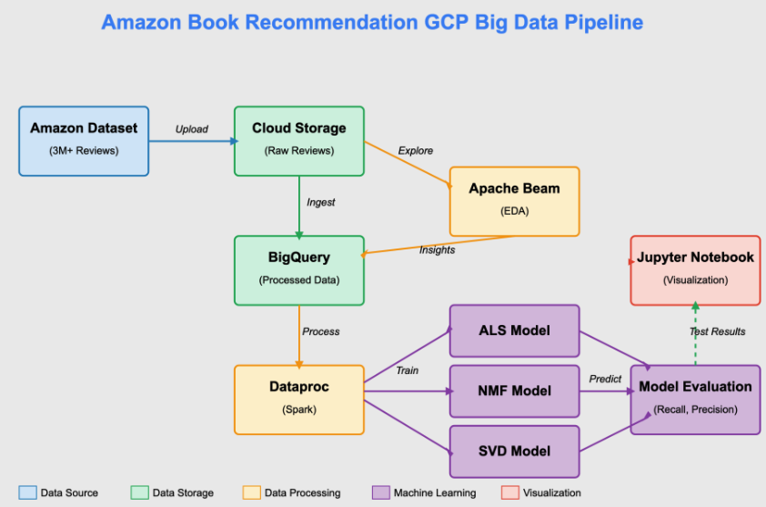

# Amazon Book Recommendation System

## Project Overview
This project implements a scalable recommendation system for Amazon book reviews using distributed computing technologies. It leverages Apache Beam, Google Cloud BigQuery, and PySpark to process large-scale book review data and implements three different recommendation algorithms (ALS, SVD, and NMF) to provide personalized book recommendations.

## Features
- **Data Processing Pipeline**: End-to-end ETL workflow using Apache Beam and BigQuery
- **Exploratory Data Analysis**: Comprehensive EDA for understanding review patterns
- **Data Preprocessing**: Filtering, transformation, and train/test splitting
- **Multiple Recommendation Algorithms**:
  - Alternating Least Squares (ALS) using Spark MLlib
  - Singular Value Decomposition (SVD) using scikit-learn
  - Non-negative Matrix Factorization (NMF) using scikit-learn
- **Model Evaluation**: Performance comparison using Recall@K and NDCG@K metrics

## Architecture


## Demo

[](https://www.youtube.com/watch?v=X7QCMEmdSWU)

## Technologies Used
- **Apache Beam**: For distributed data processing
- **Google Cloud BigQuery**: For data storage and analytical queries
- **PySpark**: For large-scale matrix operations and ALS implementation
- **scikit-learn**: For SVD and NMF implementations
- **Google Cloud Storage**: For temporary data storage
- **Jupyter Notebooks**: For interactive development and visualization

## Project Structure
```
├── 1_amazon_book_reviews_eda.ipynb       # Initial EDA using Apache Beam
├── 2_amazon_book_reviews_preprocessing.ipynb  # Data preprocessing pipeline
├── 3_recommendation_models_comparison.ipynb   # Model training and evaluation
├── data/
│   └── amazon_reviews_us_Books_v1_02.tsv  # Source dataset (not included)
├── README.md
└── requirements.txt
```

## Dataset
The project uses the Amazon Customer Reviews dataset (Books category), which contains:
- Product and customer information
- Star ratings (1-5)
- Review text and metadata
- Verified purchase status

## Workflow

### 1. Exploratory Data Analysis
- Data loading and basic information extraction
- Rating distribution analysis
- User engagement patterns
- Product review frequency analysis

### 2. Data Preprocessing
- Loading TSV data into BigQuery
- Filtering high-frequency users and products (≥30 reviews)
- Creating ID mappings for users and products
- Splitting data into training (80%) and testing (20%) sets

### 3. Model Training and Evaluation
- Training three recommendation algorithms with 50 latent factors:
  - ALS (Alternating Least Squares)
  - SVD (Singular Value Decomposition)
  - NMF (Non-negative Matrix Factorization)
- Evaluating models using Recall@20 and NDCG@20 metrics
- Comparing model performance and training times

## Results
The models were evaluated on their ability to recommend books that users actually rated in the test set. Performance metrics include:
- **Recall@20**: Measures how many of the actual items are captured in the top-20 recommendations
- **NDCG@20**: Measures the ranking quality of the recommendations
- **Training Time**: Computational efficiency of each algorithm

## Getting Started

### Prerequisites
- Python 3.7+
- Google Cloud Platform account
- Apache Beam
- PySpark
- scikit-learn

### Installation
1. Clone this repository
```bash
git clone https://github.com/yourusername/amazon-book-recommendation.git
cd amazon-book-recommendation
```

2. Install required packages
```bash
pip install -r requirements.txt
```

3. Configure Google Cloud credentials
```bash
export GOOGLE_APPLICATION_CREDENTIALS="path/to/your/service-account-key.json"
```

4. Download the Amazon Book Reviews dataset from the [Registry of Open Data on AWS](https://registry.opendata.aws/amazon-reviews/)

### Running the Project
1. Run the EDA notebook
```bash
jupyter notebook 1_amazon_book_reviews_eda.ipynb
```

2. Run the preprocessing pipeline
```bash
jupyter notebook 2_amazon_book_reviews_preprocessing.ipynb
```

3. Train and evaluate recommendation models
```bash
jupyter notebook 3_recommendation_models_comparison.ipynb
```

## Future Improvements
- Add content-based filtering using review text
- Implement hybrid recommendation approaches
- Build a web interface for interactive recommendations
- Deploy the model using cloud services
- Incorporate temporal dynamics of user preferences

## License
This project is licensed under the MIT License - see the LICENSE file for details.

## Acknowledgments
- Amazon Customer Reviews Dataset
- Google Cloud Platform
- Apache Beam and Apache Spark communities